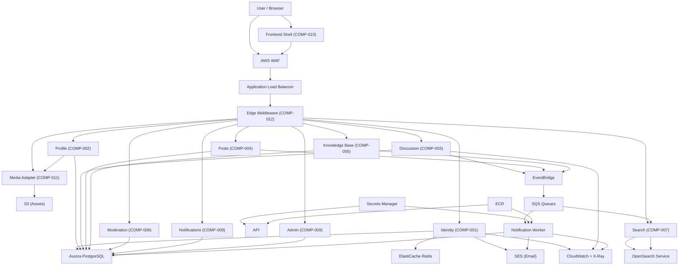

> Further rationale and trade-offs are recorded in [Decision Log](./decision-log.md). See [Design](./design.md) §10 for open decisions (DEC-001–DEC-006).

---

Full-text search is served by AWS OpenSearch Service. Content events (discussions, posts, KB articles) published by the API are routed through EventBridge to SQS and consumed by the search indexer (`backend/app/services/search/subscriber.py`) — an idempotent pipeline keyed on `(entity_type, entity_id, version)` that keeps the search index consistent with the primary store. Email and in-portal notifications are dispatched by a separate SQS-backed worker (`backend/app/services/notification_service.py`) that honors per-user opt-out preferences and falls back gracefully on SES failures.
All infrastructure is declared in OpenTofu/Terraform and parameterised per environment (`beta` / `prod`). Secrets (database credentials, API keys, session signing material) are stored in AWS Secrets Manager and injected as environment variables at ECS task launch time — never baked into container images or committed to source control. AWS CloudWatch collects structured JSON logs and metrics; AWS X-Ray provides distributed tracing across service boundaries. AWS WAF sits in front of the ALB to provide OWASP rule-set protection, rate limiting, and geo controls.
The backend is implemented in **Python 3.12 / FastAPI** (`backend/`), with SQLAlchemy for ORM persistence, Alembic for migrations, and pytest for automated testing. The frontend is a **React 18 + TypeScript** SPA (`frontend/`) built with Vite and a custom design-system component library (`frontend/src/design-system/`). The admin route guard (`frontend/src/middleware/adminGuard.ts`) enforces deny-by-default navigation — unauthenticated requests are redirected to `/login` with the original URL preserved in a `next` parameter and restored after successful login.
| **Discussion** | COMP-003 | Thread/reply CRUD, lock/hide state, moderation report intake + queue | `backend/app/services/discussion/`, `backend/app/routers/discussions.py` | Aurora (`STORE-003`), EventBridge (`IF-017`) |
| **Posts** | COMP-004 | Post/draft/comment CRUD, publish-state events | `backend/app/services/posts/` | Aurora (`STORE-004`), EventBridge (`IF-017`) |
| **Knowledge Base** | COMP-005 | KB article authoring, approval workflow, revision history | `backend/app/services/kb/`, `backend/app/kb/` | Aurora (`STORE-005`), EventBridge (`IF-017`) |
| **Moderation** | COMP-006 | Moderation report intake, queue listing, lock/hide/delete actions + audit | `backend/app/services/moderation/` | Aurora (`STORE-006`), COMP-003 |
| **Search Indexer** | COMP-007 | Event-driven indexing, idempotent upsert, full reconciliation job | `backend/app/services/search/`, `backend/services/search/reconcile.py` | OpenSearch (`STORE-007`), SQS/EventBridge |
| **Notifications** | COMP-008 | Preference API + SQS-backed dispatch worker (email + in-portal) | `backend/app/services/notifications/`, `backend/app/services/notification_service.py` | Aurora (`STORE-008`), SQS, SES |
| **Admin** | COMP-009 | Account activate/deactivate/delete, role assign/revoke, taxonomy, dashboard | `backend/app/services/admin/` | Aurora, all service components |
| **Frontend Shell** | COMP-010 | React SPA, design-system component library, admin route guard | `frontend/` | API Service (HTTPS) |
| **Media Adapter** | COMP-011 | Pre-signed S3 PUT/GET URL issuance, content-type/size validation | `backend/app/services/media/` | S3 (private bucket) |
| **API Edge** | COMP-012 | TLS termination, CORS, security headers, WAF integration | AWS ALB + `backend/app/middleware/security_headers.py` | All backend services |
## Critical Journey Flows

The following summarises how the major system components collaborate across the nine verified critical user journeys (JRN-001–JRN-009, verified in `tests/e2e/`, VER-024).

### JRN-001 — New Member Registration
```
Browser → WAF/ALB → COMP-012 (edge headers) → COMP-001 (register)
  → STORE-001 (Aurora: insert user) → SES (verification email)
  → COMP-001 (verify token) → STORE-001 (mark email_verified_at)
```

### JRN-002 — Authenticated Login with MFA
```
Browser → WAF/ALB → COMP-001 (login)
  → STORE-001 (credential check) → STORE-002 (Redis: lockout counter)
  → COMP-001 (MFA challenge) → COMP-001 (issue JWT + refresh token)
  → STORE-002 (Redis: session write)
```

### JRN-003 — Member Creates Discussion Thread
```
Browser → COMP-012 → COMP-001 (authn middleware) → COMP-003 (thread create)
  → sanitiser (DEC-001) → STORE-003 (Aurora: insert thread)
  → EventBridge (IF-017: thread.created) → SQS → COMP-007 (search indexer)
```

### JRN-004 — Member Creates and Publishes a Post
```
Browser → COMP-012 → COMP-001 (authn) → COMP-004 (post create draft)
  → STORE-004 (Aurora: draft) → COMP-004 (publish transition)
  → EventBridge (IF-017: post.published) → SQS → COMP-007 (index)
                                          ↘ SQS → COMP-008 (notify commenters)
```

### JRN-005 — Content Contributor Authors a KB Article
```
Browser → COMP-012 → COMP-001 (authn + Contributor role check) → COMP-005 (article create)
  → sanitiser → STORE-005 (Aurora: kb_articles, kb_revisions)
Moderator/Admin: COMP-005 (approve) → STORE-005 (status=approved)
  → EventBridge (IF-017: kb.approved) → SQS → COMP-007 (index)
```

### JRN-006 — Member Searches Content
```
Browser → COMP-012 → COMP-007 (search query API, IF-014)
  → STORE-007 (OpenSearch: parameterized query + role-aware visibility filter)
  → response: hits with empty-state fallback
```

### JRN-007 — Moderator Reviews and Acts on Report
```
Member: Browser → COMP-006 (report intake, IF-008) → STORE-006 (Aurora: reports, unique constraint)
Moderator: Browser → COMP-006 (queue listing + action, IF-009)
  → STORE-006 (moderation_actions append-only) + CloudWatch (structured audit log)
  → COMP-003/COMP-004 (lock/hide/delete state update)
```

### JRN-008 — Admin Deactivates an Account
```
Admin: Browser → COMP-009 (account status endpoint)
  → STORE-001 (Aurora: user status update) → STORE-002 (Redis: bulk session invalidation)
  → All subsequent requests from that user → 401 (session key gone)
```

### JRN-009 — Member Receives a Notification
```
EventBridge (IF-017: comment.created on post) → SQS (notification-queue)
  → COMP-008 dispatch worker → STORE-008 (check opt-out preferences)
  → If opted-in: SES (email dispatch) / In-portal write to STORE-008 (notification_log)
  → SES failure → in-portal only, no user-facing error
```

---

## Commit Slice Summary

The delivery is structured into 23 mergeable slices. Each slice has a defined merge boundary and dependency set. This table provides a quick reference; see [Decision Log](./decision-log.md) and [Plan](./plan.md) for the full sprint/phase-to-slice mapping.

| Slice | Phase(s) | Merge Boundary |
|-------|----------|----------------|
| SLICE-001 | PHASE-001, PHASE-002 | After network + CI/CD gates verified |
| SLICE-002 | PHASE-003, PHASE-004 | After WAF/edge headers pass (VER-006, VER-013) |
| SLICE-003 | PHASE-005 | After component library Storybook builds cleanly |
| SLICE-004 | PHASE-006, PHASE-007 | After data-store connectivity + pipeline dry-run |
| SLICE-005 | PHASE-008, PHASE-009 | After registration/verification tests green |
| SLICE-006 | PHASE-010, PHASE-011, PHASE-012 | After login/MFA/reset/access-gating tests green |
| SLICE-007 | PHASE-013 | After full auth/session suite passes (identity sign-off gate) |
| SLICE-008 | PHASE-014, PHASE-015 | After profile/avatar tests pass |
| SLICE-009 | PHASE-016, PHASE-017, PHASE-018, PHASE-019 | After admin/taxonomy authorization suite passes |
| SLICE-010 | PHASE-020, PHASE-021 | After thread/reply/lock/hide tests pass |
| SLICE-011 | PHASE-022, PHASE-023, PHASE-024 | After moderation suite passes |
| SLICE-012 | PHASE-025, PHASE-026 | After post/draft tests pass |
| SLICE-013 | PHASE-027, PHASE-028 | After comment/publish-event tests pass |
| SLICE-014 | PHASE-029, PHASE-030, PHASE-031 | After KB authoring/approval/revision tests pass |
| SLICE-015 | PHASE-032 | After KB suite passes |
| SLICE-016 | PHASE-033, PHASE-035 | After indexing + reconciliation tests pass (requires all content types) |
| SLICE-017 | PHASE-034, PHASE-036 | After search query/visibility suite passes |
| SLICE-018 | PHASE-037, PHASE-038, PHASE-039 | After notification dispatch suite passes |
| SLICE-019 | PHASE-040, PHASE-041 | After dashboard suite passes |
| SLICE-020 | PHASE-042, PHASE-043 | After rate-limit/CSRF hardening tests pass |
| SLICE-021 | PHASE-044, PHASE-045 | After accessibility + E2E gates green (ship-readiness gate) |
| SLICE-022 | PHASE-046 | After security/log/secrets audit clean (final hardening) |
| SLICE-023 | PHASE-047 | After docs reviewed (final documentation slice) |
# Architecture Overview

## High-Level Architecture

The platform is structured as a set of discrete, independently deployable service modules running on AWS ECS/Fargate within a private VPC. A public-facing API layer (behind AWS WAF and an Application Load Balancer) handles all inbound requests. The backend services communicate with a shared Aurora PostgreSQL cluster for relational persistence, an ElastiCache Redis cluster for sessions and caching, and AWS S3 for binary asset storage. Asynchronous work — notifications, search index updates, and audit events — flows through SQS queues and EventBridge rules consumed by a dedicated notifications worker service.


## Component Breakdown

| Component | ID | Responsibility | Technology | Communicates With |
|-----------|----|----------------|------------|-------------------|
| **Identity** | COMP-001 | Registration, email verification, login, MFA, lockout, password reset, session invalidation | `services/identity/` on ECS/Fargate | Aurora (`STORE-001`), ElastiCache (session store), SES (email links) |
| **Profile** | COMP-002 | Member profile view/edit, avatar pre-signed upload | `services/profile/` on ECS/Fargate | Aurora (`STORE-001`), S3 (avatars via COMP-011) |
| **Aurora PostgreSQL** | STORE-001…009 | Relational persistence — users, profiles, threads, posts, KB, moderation, search-meta, notifications, taxonomy | AWS Aurora (PostgreSQL 15.x) | All service components |
| **ElastiCache Redis** | STORE-002 | Session store (HttpOnly/Secure/SameSite cookie-backed), rate-limit counters | AWS ElastiCache (Redis) | COMP-001, rate-limit middleware |
| **OpenSearch** | STORE-007 | Full-text search index | AWS OpenSearch Service | COMP-007 (read+write) |
| **S3** | — | Avatar and media asset storage (private bucket, no public ACL) | AWS S3 | COMP-011, COMP-002, COMP-004 |
| **SQS / EventBridge** | — | Async event bus: content events → search indexer + notification worker | AWS SQS + EventBridge | All content services (publisher), COMP-007/008 (consumer) |
| **SES** | — | Transactional email delivery | AWS SES | COMP-001 (verification/reset), COMP-008 (notifications) |
| **WAF + ALB** | — | Ingress protection, load balancing, TLS termination | AWS WAF + ALB | COMP-012 → all backend services |
| **CloudWatch + X-Ray** | — | Structured JSON logs, metrics, distributed tracing | AWS CloudWatch, X-Ray | All services |
| **Secrets Manager** | — | Runtime secrets injection into ECS tasks | AWS Secrets Manager | ECS task definitions |
| **ECR** | — | Container image registry | AWS ECR | ECS / CI-CD |
| **IaC (OpenTofu)** | — | Provision and manage all AWS resources | OpenTofu / Terraform | All AWS resources |

## Architecture Diagram



## Key Architecture Decisions

| Decision | Options Considered | Chosen | Rationale |
|----------|--------------------|--------|-----------|
| Compute platform | EC2 (self-managed), ECS/Fargate, EKS | ECS/Fargate (pending DEC-005 final lock-in) | Serverless containers reduce operational overhead; no cluster management; auto-scales per task; fits AWS-only guardrail |
| Relational database | RDS PostgreSQL, Aurora PostgreSQL, DynamoDB | Aurora PostgreSQL | Serverless v2 scaling, multi-AZ HA, PostgreSQL compatibility, familiar query model for relational content/user data |
| Search engine | OpenSearch Service (AWS-managed), self-hosted Elasticsearch, RDS full-text | OpenSearch Service (sizing pending DEC-006) | Fully managed, no cluster infra, native AWS IAM auth, rich query DSL; self-hosted adds operational burden |
| Async messaging | SNS fanout only, SQS alone, EventBridge + SQS | EventBridge + SQS | EventBridge provides schema-aware event routing and replay; SQS provides durable per-consumer queues with DLQ support |
| Notification channel scope | Email only, Email + Push, Email + SMS + Push | SES (email) + in-portal confirmed; SNS Push / SMS pending DEC-002 | SES is the confirmed MVP channel; in-portal is a fallback when SES fails; additional channels require DEC-002 |
| Content sanitiser library | DOMPurify (client-side), server-side whitelist library, custom | Pending DEC-001 / DEC-003 | Library selection blocked on security review; interface is stable, implementation slot reserved |
| IaC toolchain | AWS CDK, CloudFormation, Terraform/OpenTofu | OpenTofu (Terraform-compatible) | Open-source, provider-neutral DSL targeting AWS only; per-environment var-files (`beta.tfvars` / `prod.tfvars`) |
| Secret management | SSM Parameter Store, Secrets Manager, env-file injection | AWS Secrets Manager | Rotation support, fine-grained IAM policies, audit trail via CloudTrail; injected at ECS task launch |
| Session store | JWT-only (stateless), Redis-backed session, DB-backed session | ElastiCache Redis with HttpOnly/Secure/SameSite cookie | Enables immediate invalidation (TASK-013/014); atomic Redis TTL semantics for lockout counters |
| Role evaluation | Role baked in JWT, role re-checked per request | Per-request DB re-evaluation for privilege-sensitive operations | Ensures role changes take effect without re-login (AC-032.1/.2) — required by TASK-029 |
| Search indexing idempotency | Event-at-least-once, deduplication via DB, keyed upsert | Idempotent upsert keyed on `(entity_type, entity_id, version)` | Handles SQS redelivery without duplication; safe for full-reindex reconciliation job (TASK-049/051) |
| KB approval workflow | Auto-publish on save, manual publish by author, moderator/admin approval | Moderator/admin approve/reject | Prevents unapproved content from reaching the search index or member views; maps to AC-023.x |
| Moderation audit trail | Application log only, append-only DB table, CloudTrail only | Append-only Aurora `audit_log` table + structured CloudWatch log | Satisfies AC-014.3/.4 (immutable record per action) and NFR-016 (structured correlation ID log) |

