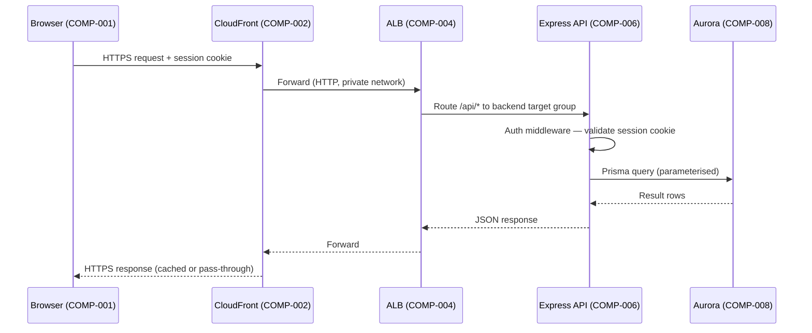
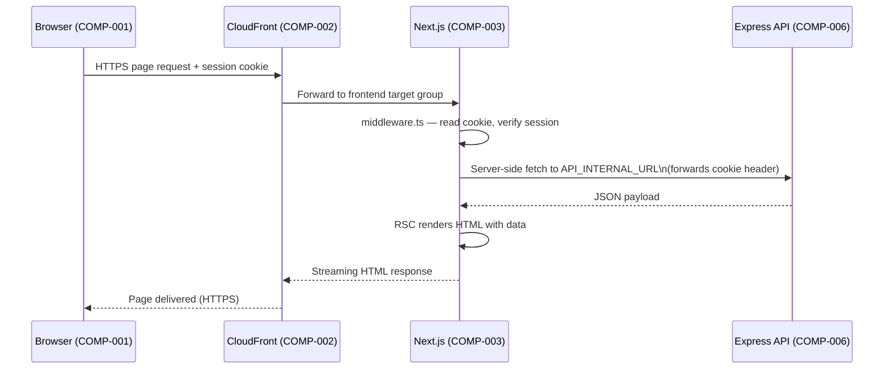
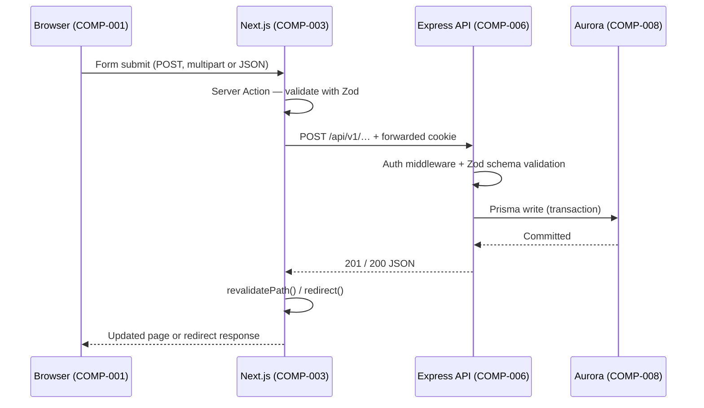

# Architecture Overview

> This document describes the system's component model (COMP-001 – COMP-012), their
> responsibilities, inter-component relationships, and the AWS deployment topology.
> Keep this document updated whenever a component boundary or integration contract changes.

---

## Table of Contents

1. [System Summary](#1-system-summary)
2. [Component Model (COMP-001 – COMP-012)](#2-component-model-comp-001--comp-012)
3. [Component Interaction Narrative](#3-component-interaction-narrative)
4. [Data Flow Diagrams](#4-data-flow-diagrams)
   - [4a. Browser → API request (authenticated)](#4a-browser--api-request-authenticated)
   - [4b. Server Component data fetch](#4b-server-component-data-fetch)
   - [4c. Mutation (form submit → server action → API)](#4c-mutation-form-submit--server-action--api)
5. [AWS Deployment Topology](#5-aws-deployment-topology)
6. [Security Boundaries](#6-security-boundaries)
7. [Key Design Decisions](#7-key-design-decisions)
8. [Diagram Reference](#8-diagram-reference)

---

## 1. System Summary

The application is a multi-tenant web platform delivered as a **Next.js 14 (App Router)**
frontend and a **Node.js/Express** backend API, deployed on AWS using ECS Fargate with an
Aurora PostgreSQL database. The two apps share a single Git monorepo and a common CI/CD
pipeline but are built, containerised, and scaled independently.

All authentication state is carried by **HTTP-only secure cookies** issued by the backend.
The frontend reads auth server-side (via Next.js `cookies()`) and never stores tokens in
`localStorage` or exposes them to client JavaScript.

---

## 2. Component Model (COMP-001 – COMP-012)

### COMP-001 — Web Browser (Client)

| Attribute | Value |
|-----------|-------|
| **Type** | External actor |
| **Boundary** | Public internet |
| **Responsibilities** | Render React client components; submit forms; hold session cookie (HTTP-only, Secure, SameSite=Lax) |
| **Communicates with** | COMP-002 (CloudFront / CDN edge), COMP-003 (Next.js frontend) |

---

### COMP-002 — CloudFront Distribution (CDN / Edge)

| Attribute | Value |
|-----------|-------|
| **Type** | AWS-managed CDN |
| **Boundary** | AWS edge network |
| **Responsibilities** | TLS termination; cache static assets from S3; route `/api/*` and dynamic routes to the Application Load Balancer; set security response headers (HSTS, X-Frame-Options, CSP) |
| **Communicates with** | COMP-001 (browser), COMP-004 (Application Load Balancer), COMP-005 (S3 static assets) |

---

### COMP-003 — Next.js Frontend Service

| Attribute | Value |
|-----------|-------|
| **Type** | Application service (ECS Fargate task) |
| **Boundary** | Private VPC subnet (not directly internet-facing) |
| **Responsibilities** | Server-side rendering (RSC); route handling; `middleware.ts` auth guard; server actions for mutations; serve client component bundles; read session cookies server-side via `cookies()` |
| **Internal sub-units** | `app/` (App Router pages and layouts), `components/` (UI), `hooks/` (client state), `lib/` (API client, generated types), `middleware.ts` (auth guard) |
| **Communicates with** | COMP-002 (receives requests), COMP-006 (calls Express REST API over internal network), COMP-007 (Secrets Manager for runtime config) |

---

### COMP-004 — Application Load Balancer (ALB)

| Attribute | Value |
|-----------|-------|
| **Type** | AWS-managed load balancer |
| **Boundary** | Private VPC — internet-facing listener, but targets are private |
| **Responsibilities** | Layer-7 routing; health checks; forward requests to frontend (COMP-003) or backend (COMP-006) target groups based on path prefix |
| **Communicates with** | COMP-002 (CloudFront origin), COMP-003 (frontend target group), COMP-006 (backend target group) |

---

### COMP-005 — S3 Static Asset Bucket

| Attribute | Value |
|-----------|-------|
| **Type** | AWS S3 bucket |
| **Boundary** | Private (CloudFront Origin Access Control only) |
| **Responsibilities** | Store Next.js `_next/static/` build output; user-uploaded files (separate prefix, private ACL) |
| **Communicates with** | COMP-002 (CloudFront OAC fetch), COMP-003 (Next.js uploads via AWS SDK) |

---

### COMP-006 — Express REST API Service

| Attribute | Value |
|-----------|-------|
| **Type** | Application service (ECS Fargate task) |
| **Boundary** | Private VPC subnet |
| **Responsibilities** | Authenticate and authorise all requests; enforce business rules; expose a versioned REST API (`/api/v1/…`); issue and revoke HTTP-only session cookies; validate inputs with Zod; emit structured logs and X-Ray traces |
| **Internal sub-units** | `routes/` (Express routers), `controllers/` (request handling), `services/` (business logic), `middleware/` (auth, validation, error), `utils/` (shared helpers) |
| **Communicates with** | COMP-003 (receives server-side calls), COMP-001 (receives browser calls via ALB/CloudFront for client-side fetches), COMP-008 (Aurora DB), COMP-007 (Secrets Manager), COMP-009 (CloudWatch / X-Ray) |

---

### COMP-007 — AWS Secrets Manager

| Attribute | Value |
|-----------|-------|
| **Type** | AWS-managed secrets store |
| **Boundary** | AWS control plane (VPC endpoint) |
| **Responsibilities** | Store and rotate `SESSION_SECRET`, `DATABASE_URL`, third-party API keys, and other runtime secrets; provide them to ECS task roles at startup via environment injection |
| **Communicates with** | COMP-003 (frontend reads `API_INTERNAL_URL` and any server-only config), COMP-006 (backend reads all runtime secrets) |

---

### COMP-008 — Aurora PostgreSQL (RDS)

| Attribute | Value |
|-----------|-------|
| **Type** | AWS RDS Aurora Serverless v2 (PostgreSQL 15 compatible) |
| **Boundary** | Isolated private subnet — no public endpoint |
| **Responsibilities** | Persist all application data; enforce referential integrity; provide read replicas for read-heavy workloads |
| **Communicates with** | COMP-006 (Prisma ORM connections from backend only — frontend never queries the DB directly) |

---

### COMP-009 — Observability Stack (CloudWatch + X-Ray)

| Attribute | Value |
|-----------|-------|
| **Type** | AWS-managed observability services |
| **Boundary** | AWS control plane |
| **Responsibilities** | Collect structured application logs (no secrets or PII in log lines); distributed traces across frontend and backend; metric alarms (error rate, latency, CPU) |
| **Communicates with** | COMP-003 (Next.js log sink), COMP-006 (Express log sink + X-Ray SDK), COMP-004 (ALB access logs) |

---

### COMP-010 — CI/CD Pipeline (GitHub Actions)

| Attribute | Value |
|-----------|-------|
| **Type** | External SaaS (GitHub) with OIDC-federated AWS access |
| **Boundary** | GitHub-hosted runners; OIDC trust to AWS IAM role (no long-lived keys) |
| **Responsibilities** | On every PR: lint, type-check, unit tests, build check. On merge to `main`: build Docker images, push to ECR, deploy to staging ECS. On release tag: promote to production. |
| **Communicates with** | COMP-011 (ECR — push images), COMP-003 / COMP-006 (ECS — rolling deploy), COMP-007 (read-only via OIDC role for deploy-time config) |

---

### COMP-011 — Amazon ECR (Container Registry)

| Attribute | Value |
|-----------|-------|
| **Type** | AWS-managed container registry |
| **Boundary** | Private (VPC endpoint) |
| **Responsibilities** | Store and version Docker images for frontend and backend; lifecycle policies to purge old untagged images; image scanning for known CVEs |
| **Communicates with** | COMP-010 (CI/CD pushes images), COMP-003 / COMP-006 (ECS pulls images at deploy time) |

---

### COMP-012 — Infrastructure-as-Code (AWS CDK)

| Attribute | Value |
|-----------|-------|
| **Type** | Developer tooling (TypeScript CDK app under `infra/`) |
| **Boundary** | Developer machine / CI runner — synthesises CloudFormation |
| **Responsibilities** | Declare and version all AWS resources (VPC, ECS cluster, ALB, Aurora, S3, CloudFront, Secrets Manager, IAM roles, CloudWatch alarms); enforce least-privilege IAM; provide repeatable environment bootstrapping |
| **Communicates with** | All AWS components (COMP-002–COMP-011) via CloudFormation stacks |

---

## 3. Component Interaction Narrative

### Startup

1. **COMP-012 (CDK)** synthesises and deploys CloudFormation stacks that create the VPC,
   Aurora cluster (COMP-008), ALB (COMP-004), ECS Fargate services (COMP-003, COMP-006),
   S3 bucket (COMP-005), CloudFront distribution (COMP-002), and Secrets Manager entries
   (COMP-007).
2. **COMP-010 (CI/CD)** builds Docker images, pushes them to COMP-011 (ECR), and triggers
   rolling ECS deployments. ECS task roles assume the IAM execution role, which allows
   reading secrets from COMP-007 at container start.

### Authentication flow

1. The browser (COMP-001) sends `POST /api/v1/auth/login` credentials.
2. CloudFront (COMP-002) passes the request to ALB (COMP-004), which routes `/api/*` to the
   backend target group (COMP-006).
3. The backend validates credentials against COMP-008, creates a session record, and issues
   an **HTTP-only `Set-Cookie`** response header.
4. The browser stores the cookie automatically; JavaScript cannot read it.
5. On subsequent navigations, the Next.js server (COMP-003) reads the cookie via
   `cookies()`, validates it with a server-side call to COMP-006 (`/api/v1/auth/me`), and
   decides whether to render protected content or redirect to `/login`.

### Authenticated data request (server component)

See [§4b](#4b-server-component-data-fetch) for the sequence diagram.

### Mutation (create / update / delete)

See [§4c](#4c-mutation-form-submit--server-action--api) for the sequence diagram.

---

## 4. Data Flow Diagrams

Diagrams use [Mermaid](https://mermaid.js.org/) syntax, renderable in GitHub, GitLab,
and most modern documentation platforms.

### 4a. Browser → API request (authenticated)



### 4b. Server Component data fetch



### 4c. Mutation (form submit → server action → API)



---

## 5. AWS Deployment Topology

```
Internet
  │
  ▼
┌──────────────────────────────────────────────────────────┐
│  AWS Edge Network                                        │
│  ┌─────────────────────────────────────────────────┐    │
│  │  CloudFront Distribution (COMP-002)             │    │
│  │  • TLS termination (ACM certificate)            │    │
│  │  • Static asset caching (/static/*, /_next/*)   │    │
│  │  • Security headers (HSTS, CSP, X-Frame)        │    │
│  └───────────┬─────────────────────┬───────────────┘    │
└──────────────│─────────────────────│────────────────────┘
               │ Dynamic requests    │ Static assets
               ▼                     ▼
  ┌────────────────────┐   ┌────────────────────┐
  │  ALB (COMP-004)    │   │  S3 Bucket         │
  │  (VPC, public      │   │  (COMP-005)        │
  │   subnet listener) │   │  OAC-only access   │
  └────────┬───────────┘   └────────────────────┘
           │
   ┌───────┴────────────────────────────┐
   │ Path-based routing                 │
   │  /* → frontend TG                  │
   │  /api/* → backend TG               │
   └───────┬──────────────┬─────────────┘
           ▼              ▼
  ┌─────────────┐   ┌─────────────┐
  │ ECS Fargate │   │ ECS Fargate │      AWS Private Subnet
  │  Next.js    │   │  Express    │
  │  (COMP-003) │   │  (COMP-006) │
  └──────┬──────┘   └──────┬──────┘
         │                 │
         │          ┌──────▼──────┐
         │          │  Aurora PG  │
         │          │  (COMP-008) │
         │          │  Isolated   │
         │          │  subnet     │
         │          └─────────────┘
         │
  ┌──────▼─────────────────────────────┐
  │  AWS Supporting Services           │
  │  • Secrets Manager (COMP-007)      │
  │  • CloudWatch + X-Ray (COMP-009)   │
  │  • ECR (COMP-011)                  │
  └────────────────────────────────────┘

  CI/CD (COMP-010 — GitHub Actions, external)
    └── OIDC → IAM role → push ECR / deploy ECS
```

**Network rules (summary):**

| Source | Destination | Port | Protocol |
|--------|-------------|------|----------|
| CloudFront | ALB | 443 | HTTPS |
| ALB | ECS Frontend (COMP-003) | 3000 | HTTP (private) |
| ALB | ECS Backend (COMP-006) | 4000 | HTTP (private) |
| ECS Frontend | ECS Backend | 4000 | HTTP (private, internal DNS) |
| ECS Backend | Aurora | 5432 | PostgreSQL (private) |
| ECS tasks | Secrets Manager | 443 | HTTPS (VPC endpoint) |
| ECS tasks | ECR | 443 | HTTPS (VPC endpoint) |
| ECS tasks | CloudWatch / X-Ray | 443 | HTTPS (VPC endpoint) |

No ECS task or database has a public IP address. All inbound internet traffic enters
exclusively through CloudFront.

---

## 6. Security Boundaries

| Boundary | Enforcement mechanism |
|----------|-----------------------|
| Internet → application | CloudFront WAF rules; HTTPS-only (HTTP redirected); HSTS |
| Unauthenticated → protected routes | `middleware.ts` redirects to `/login`; backend middleware returns `401` |
| Frontend → backend auth | HTTP-only `Secure SameSite=Lax` session cookie; never in JS scope |
| Backend → database | Private subnet + Security Group (only ECS backend SG allowed); Prisma parameterised queries (injection prevention) |
| Secrets at rest | AWS Secrets Manager; ECS task role with least-privilege `secretsmanager:GetSecretValue` only on named ARNs |
| Secrets in transit | TLS everywhere on the private network (VPC endpoints); no plaintext credentials in logs or environment variables visible to `printenv` |
| CI/CD → AWS | OIDC federation (no long-lived IAM access keys); scoped deploy role |
| Container images | ECR image scanning on push; lifecycle policy removes untagged images after 30 days |

---

## 7. Key Design Decisions

| Decision | Rationale | ADR |
|----------|-----------|-----|
| Next.js App Router with RSC | SSR for SEO and TTFB; server components fetch data without waterfalls; `cookies()` enables secure server-side auth | ADR-001 |
| HTTP-only cookies (not bearer tokens) | Tokens never in browser JS scope; eliminates XSS token theft; aligns with SameSite CSRF protection | ADR-002 |
| Express (not Next.js Route Handlers for all API) | Dedicated API service scales independently; clearer contract boundary; existing team expertise in Express | ADR-003 |
| Aurora Serverless v2 | Auto-scales to zero in non-production environments; cost-effective for variable workloads; PostgreSQL-compatible | ADR-004 |
| AWS CDK (TypeScript) | Infrastructure co-located with application code in the same language; full type safety; no DSL context-switching | ADR-005 |
| Prisma ORM | Type-safe query builder from the schema; migration management; Zod integration for DTO generation | ADR-006 |

Full rationale for each decision is in [`docs/decision-log.md`](./decision-log.md).

---

## 8. Diagram Reference

| Diagram | Format | Location |
|---------|--------|----------|
| Component interaction (Mermaid) | Inline Mermaid | §4 of this document |
| AWS topology (ASCII) | ASCII art | §5 of this document |
| ER / data model | Prisma schema | `backend/prisma/schema.prisma` |
| CI/CD pipeline | GitHub Actions YAML | `.github/workflows/` |
| Network / VPC diagram | Mermaid (planned) | `docs/diagrams/network.md` (TBD) |

To render Mermaid diagrams locally, install the
[Mermaid VS Code extension](https://marketplace.visualstudio.com/items?itemName=bierner.markdown-mermaid)
or use the [Mermaid Live Editor](https://mermaid.live/).
